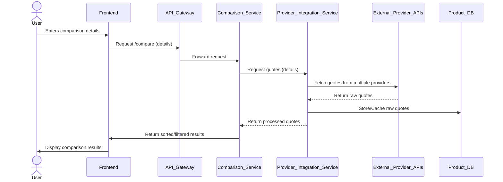
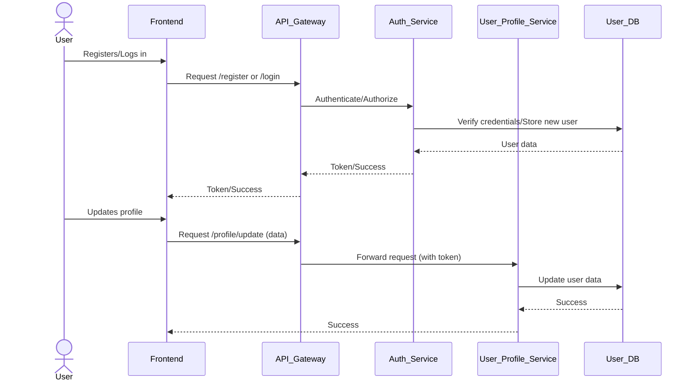
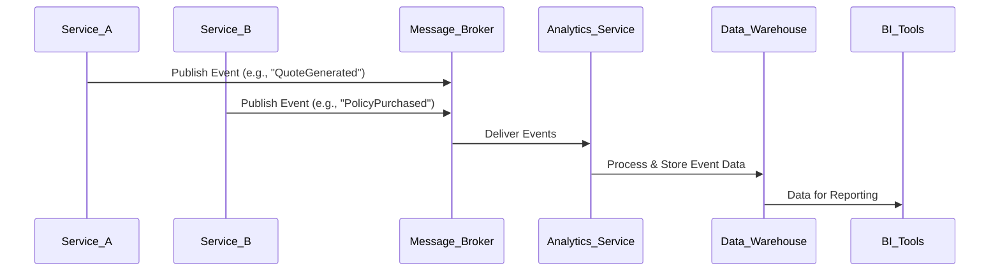

# Data Flow Overview

Understanding how data moves through the system is crucial for developing and troubleshooting the PCW application. This section provides a simplified overview of key data flows.

## 1. User Comparison & Quote Generation

## 2. User Account & Profile Management

## 3. Event-Driven Analytics

These diagrams provide a simplified view. For detailed data models and API specifications, refer to the respective service documentation.