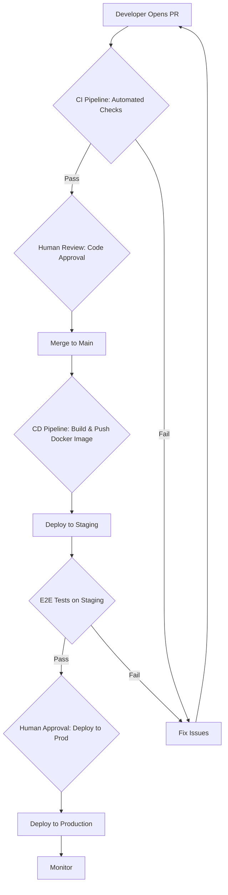

# CI/CD Pipeline Workflow

This document provides a detailed, step-by-step overview of our Continuous Integration (CI) and Continuous Deployment (CD) pipeline. The process is designed to be automated, secure, and reliable, ensuring only high-quality code reaches production.

The primary tool for this workflow is **GitHub Actions**.

---

### **Overall Process Flow**

---

### **Phase 1: Continuous Integration (CI) & Code Review (Pre-Merge)**

This phase begins when a developer opens a Pull Request (PR) and ends when it is merged into the `main` branch.

1.  **Automated Checks:** As soon as the PR is opened, the CI pipeline runs automatically. It will only run on the services/apps that have been changed.
    *   **Install Dependencies:** Runs `npm install`.
    *   **Linting & Formatting:** Runs `npm run lint` to check code style.
    *   **Unit & Integration Tests:** Runs `npm test` to verify logic.
    *   **Security Scans:** Runs `npm audit` to check for known vulnerabilities.

2.  **Human Code Review:**
    *   Human review **only begins after all automated checks have passed**.
    *   The PR must be approved by **at least two team members**, following the rules in the [Code Review Process](../04_development_workflow/04_code_review_process.md).

3.  **Merge:** Once the PR has passed all automated checks and received the required human approvals, it can be merged into the `main` branch.

---

### **Phase 2: Continuous Deployment (CD) (Post-Merge)**

This phase begins automatically after a PR is successfully merged into the `main` branch.

1.  **Build & Push Docker Image:**
    *   A new Docker image is built for each microservice that was updated.
    *   The image is tagged with a unique identifier (e.g., the Git commit hash).
    *   The new image is pushed to our central container registry (e.g., Amazon ECR).

2.  **Deploy to Staging:**
    *   The pipeline automatically deploys the new Docker images to the **Staging** environment.
    *   The Staging environment is a complete, production-like environment running on Kubernetes.

3.  **End-to-End (E2E) Testing:**
    *   Once Staging is updated, a full suite of E2E tests (using **Cypress**) is run against it.
    *   These tests simulate real user journeys to ensure all microservices work together correctly.

4.  **Production Deployment Gate:**
    *   After E2E tests pass, the pipeline **pauses** and requires **manual approval** from a designated team lead or release manager.
    *   This is the final safety gate before releasing to users.

5.  **Deploy to Production:**
    *   Upon approval, the pipeline instructs Kubernetes to perform a **rolling update** in the Production environment.
    *   This process ensures **zero downtime** by gradually replacing old application instances with new ones.

6.  **Monitor:** After deployment, the application's health is closely monitored for any anomalies in error rates or performance.
